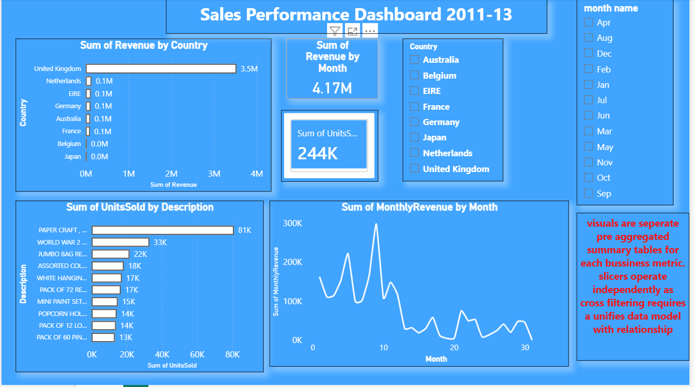

# 🛍️ Retail Sales Analysis using SQL & Power BI

## 📌 Project Overview

This project analyzes an online retail dataset using SQL and Power BI to uncover valuable business insights. The analysis focuses on identifying VIP customers, top-selling products, revenue by country, and monthly sales trends. The SQL queries generate cleaned analytical datasets, which are then visualized through an interactive Power BI dashboard.

---

## 🎯 Objectives

- Identify VIP customers based on total spending
- Find the best-selling products
- Analyze revenue generated by each country
- Track monthly sales trends
- Build an interactive Power BI dashboard for visualization

---

## 🛠️ Tools & Technologies

- SQL (SQLite)
- Power BI
- CSV Dataset
- Git & GitHub

---

## 📂 Project Structure

```
retail-sales-analysis-sql/
│
├── 1_vip_customers.csv
├── 2_best_products.csv
├── 3_country_revenue.csv
├── 4_monthly_trends.csv
├── powerbi_sales_dashboard.pbix
├── dashboard screenshot.png
├── shot1.png
├── shot2.png
├── shot3.png
├── shot4.png
└── README.md
```

---

## 📊 SQL Analysis

The following analyses were performed using SQL:

### 1. VIP Customers
- Calculated total spending for each customer.
- Ranked customers by revenue.

### 2. Best Selling Products
- Identified products with the highest quantity sold.
- Calculated total revenue per product.

### 3. Country Revenue
- Computed total sales generated by each country.
- Ranked countries based on revenue.

### 4. Monthly Sales Trends
- Aggregated monthly revenue.
- Analyzed sales growth over time.

---

## 📈 Power BI Dashboard

The dashboard includes:

- KPI Cards
- Monthly Sales Trend
- Revenue by Country
- Top Products
- VIP Customers
- Interactive Filters/Slicers

---

## 📸 Dashboard Preview



---

## 📁 Output Files

| File | Description |
|------|-------------|
| 1_vip_customers.csv | VIP customer analysis |
| 2_best_products.csv | Top-selling products |
| 3_country_revenue.csv | Country-wise revenue |
| 4_monthly_trends.csv | Monthly sales trends |
| powerbi_sales_dashboard.pbix | Power BI dashboard |

---

## 🔍 Key Insights

- Identified the highest-value customers (VIPs).
- Determined the products generating the most revenue.
- Compared revenue across different countries.
- Observed monthly sales growth and seasonal patterns.
- Built an interactive dashboard for business decision-making.

---

## 🚀 How to Use

1. Clone the repository.

```bash
git clone https://github.com/your-username/retail-sales-analysis-sql.git
```

2. Open the `.pbix` file in Power BI Desktop.

3. Explore the dashboard and insights.

---

## 📚 Skills Demonstrated

- SQL Queries
- Data Cleaning
- Data Aggregation
- Business Intelligence
- Power BI Dashboard Development
- ## 📸 Dashboard

### Power BI Dashboard


---

## 📷 SQL Query Screenshots

### VIP Customers Query


### Best Products Query


### Country Revenue Query


### Monthly Sales Trend Query


## 📊 Dataset

This project uses the Online Retail Dataset containing over **541,000** transaction records from an online retail company between **December 2010 and December 2011**.

### Dataset Summary

| Metric | Value |
|---------|-------|
| Records | 541,909 |
| Columns | 8 |
| Customers | 4,372 |
| Products | 4,070 |
| Countries | 38 |

### Key Columns

- InvoiceNo
- StockCode
- Description
- Quantity
- InvoiceDate
- UnitPrice
- CustomerID
- Country

> **Note:** The complete dataset is not included in this repository because of its large size. The SQL queries and Power BI dashboard were created using the original dataset, while the generated analysis outputs are included as CSV files.
